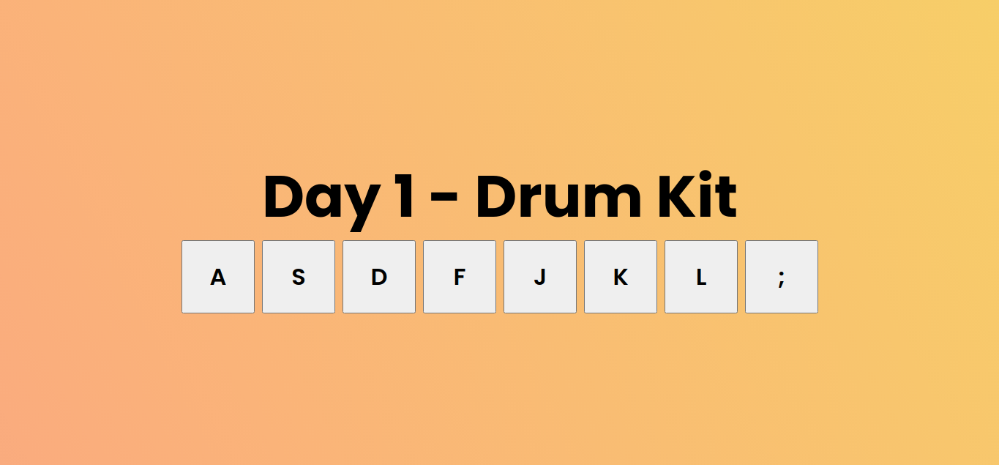
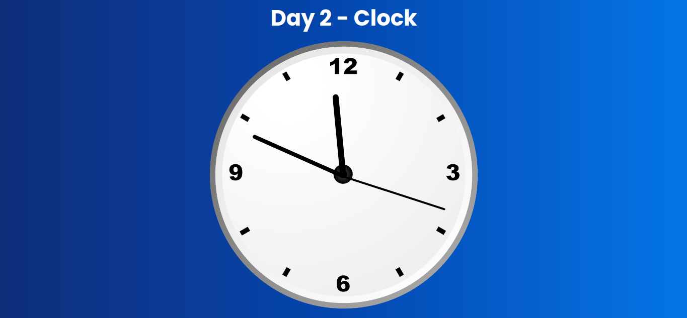

# 30 Days Javascript Challenge
This Javascipt challenge I started on Sunday July 11th, 2021
If anyone is intrested in this challenge you can follow me. In this challenge I am only using HTML, CSS and Pure Vanilla Javascript.

### Day 1 - Drum Kit

### Day 2 - Clock

#### Suggest me some more ideas: [click here][form]

### Languages that are used:

 
 

### Other:
If anyone has more ideas you can suggest me I will add those projects in my List.

[form]: https://forms.gle/sPPNwK4gcsBMNdePA
